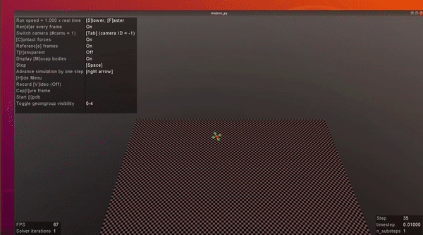
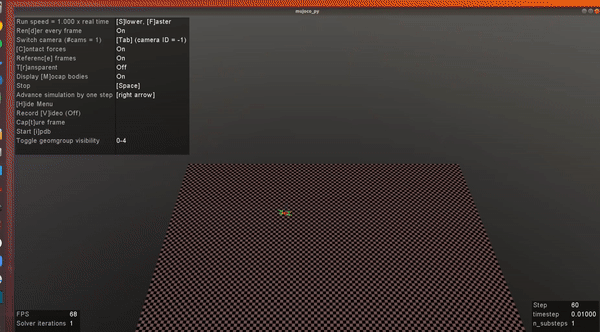

# Reinforcement Learning - Final Project

Take a look at the different training stages of the agent

baby | teenager | adult
:-------------------------:|:-------------------------:|:-------------------------:|
 |  | 
# Environment

A detailed explanation of the way the MuJoCo-based environment works and how to install it can be found [here](ENVIRONMENT.md)

In case the reader is interested to check out the home-made 
quad simulator it can be found under `./homemade_quad_simulator`.

# Algorithms

To begin with, make sure to install the dependencies for this project
```
$ git clone <this_repository>
$ cd gym_multirotor
$ make
$ source venv/bin/activate
$ pip install -e .
```

## Initial implementation
The first implementation of the SAC, DDPG and PPO can be found in 
`./first_algorithm_implementation`. These have the disadvantage of not allowing
the user to save the trained agents. Therefore, the whole process has to be 
repeated if one wants to test a new thing.

## Final implementation
The final implementation of the algorithms can be found under 
`./src`. 

The openAI Spinning Up framework was used. So, you'll FIRST have to 
install it as described [here](SPINNING_UP.md). Then, some scripts to 
automate and standarize the workflow across the different members of the 
team's platforms was developed. 

To run the automation scripts:  
```
$ ./train_first_attempt.sh
$ ./test.sh
$ ./plot.sh
```
**Note: might take a lot of time** 

* Once your training is done, the agents will be saved under `./trained_agents`.
* The testing stage requires the user to define the initial conditions
from which to start the episode and apply the policy learnt by the agent. The 
directory `./input` contains `.json` with the {vanilla, moderate and 
extreme} initial conditions. At the end of testing, the directory `./output` 
will contain all the information needed for plotting (state vector and 
actions) in `.pkl` format. 
* The plotting is the final step. The graphs are stored in `./img`.
